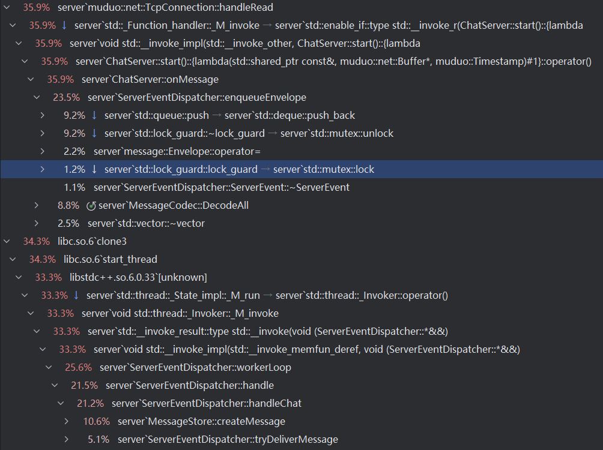

# 2026-05-22 压力测试记录

## 测试背景

- 测试环境：2 核 CPU、8 GB 内存，已关闭交换区。
- 测试程序：`bin/client`。
- 测试模型：多连接发送数据，单连接接收数据。
- 测试命令格式：`./client <发送连接数> <每个发送连接的消息数> <等待超时时间秒数>`。
- 固定参数：发送连接数为 10，等待超时时间为 30 秒。
- 测试规模：分别测试总消息数 1 万、10 万、100 万。
- 重复次数：每个规模重复 3 次。

| 测试规模 | 命令参数 | 总消息数 | 重复次数 |
| --- | --- | ---: | ---: |
| 10 连接 x 1,000 条 | `./client 10 1000 30` | 10,000 | 3 |
| 10 连接 x 10,000 条 | `./client 10 10000 30` | 100,000 | 3 |
| 10 连接 x 100,000 条 | `./client 10 100000 30` | 1,000,000 | 3 |

## 数据分析

### 结果完整性

| 总消息数 | 发送成功 | 发送失败 | 接收端 push | 发送端 ack | 结论 |
| ---: | ---: | ---: | ---: | ---: | --- |
| 10,000 | 3/3 次均为 10,000 | 3/3 次均为 0 | 3/3 次均为 10,000 | 3/3 次均为 10,000 | 发送、ack、push 数量一致 |
| 100,000 | 3/3 次均为 100,000 | 3/3 次均为 0 | 3/3 次均为 100,000 | 3/3 次均为 100,000 | 发送、ack、push 数量一致 |
| 1,000,000 | 3/3 次均为 1,000,000 | 3/3 次均为 0 | 2,348,425 - 2,468,499 | 1,003,411 - 1,006,159 | 出现重复 push / ack 计数异常，并有一次连接重置 |

### 平均性能

| 总消息数 | 平均发送耗时 | 平均 ack 耗时 | 平均 push 耗时 | 平均总耗时 | 平均客户端写入吞吐 | 平均服务端 ack 吞吐 | 平均接收端 push 吞吐 |
| ---: | ---: | ---: | ---: | ---: | ---: | ---: | ---: |
| 10,000 | 0.033 s | 0.133 s | 0.133 s | 0.133 s | 303,216 msg/s | 75,191 msg/s | 75,191 msg/s |
| 100,000 | 0.263 s | 1.331 s | 1.297 s | 1.331 s | 382,090 msg/s | 75,269 msg/s | 77,134 msg/s |
| 1,000,000 | 3.046 s | 19.212 s | 11.667 s | 19.212 s | 332,558 msg/s | 52,295 msg/s | 206,270 msg/s |

### 观察结论

1. 在 10,000 和 100,000 总消息规模下，`send_ok`、`sender_acks`、`receiver_chat_pushes` 三个计数完全一致，说明该规模下发送、服务端 ack、接收端 push 的完整性正常。
2. 10,000 到 100,000 总消息规模下，服务端 ack 吞吐稳定在约 75,000 msg/s，接收端 push 吞吐也基本处于同一量级。
3. 1,000,000 总消息规模下，`send_failed` 仍为 0，但 `receiver_chat_pushes` 明显超过总消息数，`sender_acks` 也略高于总消息数，并出现一次 `send() failed: Connection reset by peer`。这组数据不能直接作为正常吞吐结果，需要优先排查重复投递、重复 ack、计数逻辑或连接异常处理。
4. 客户端写入吞吐始终高于服务端 ack 吞吐，说明当前压测下主要瓶颈更可能出现在服务端处理、ack 路径或接收端推送路径，而不是客户端写入速度。

### 调用图分析

本次调用图来自服务端进程的采样型 CPU profiler。图中的百分比表示采样期间该调用路径占用的 CPU 样本比例，只能说明热点分布，不能直接等价为单次函数耗时。

主要热点分布如下：

| 调用路径 | 占比 | 说明 |
| --- | ---: | --- |
| `muduo::net::TcpConnection::handleRead -> ChatServer::onMessage` | 35.9% | 服务端网络读事件进入业务消息处理，是最大的一条前台处理路径。 |
| `ChatServer::onMessage -> ServerEventDispatcher::enqueueEnvelope` | 23.5% | 消息解析后进入事件分发队列，是读路径中的主要热点。 |
| `ServerEventDispatcher::enqueueEnvelope -> std::queue::push / std::deque::push_back` | 9.2% | 入队过程中容器插入成本明显，可能包含节点/缓冲区管理和对象移动成本。 |
| `ServerEventDispatcher::enqueueEnvelope -> std::lock_guard::~lock_guard -> std::mutex::unlock` | 9.2% | 入队路径存在明显加锁/解锁成本，说明队列锁是需要关注的竞争点。 |
| `MessageCodec::DecodeAll` | 8.8% | Protobuf 消息解码有一定 CPU 占用，但低于事件入队成本。 |
| `ServerEventDispatcher::workerLoop -> handle -> handleChat` | 21.2% | 后台 worker 线程主要消耗在聊天消息处理。 |
| `ServerEventDispatcher::handleChat -> MessageStore::createMessage` | 10.6% | 消息落库/建档是 worker 线程中的最大子热点。 |
| `ServerEventDispatcher::handleChat -> ServerEventDispatcher::tryDeliverMessage` | 5.1% | 在线投递路径也有一定开销，但低于消息创建。 |

从调用图看，服务端 CPU 主要消耗在两类路径：

1. 前台网络线程：`handleRead -> onMessage -> enqueueEnvelope`。这条路径占 35.9%，其中 `enqueueEnvelope` 占 23.5%，说明收到数据后把消息封装并推入分发队列的成本较高。
2. 后台 worker 线程：`workerLoop -> handleChat -> createMessage / tryDeliverMessage`。这条路径占 25.6%，说明消息进入队列后，后续建档和投递处理也是主要 CPU 消耗来源。

`enqueueEnvelope` 内部热点集中在 `std::queue::push`、`std::mutex::lock/unlock` 和 `ServerEvent::operator=`。这说明当前事件分发队列可能存在以下成本：

- 每条消息都需要经过一次共享队列入队。
- 入队需要持有互斥锁，高并发发送时锁操作会被频繁触发。
- `ServerEvent` 入队时存在对象赋值或移动成本。
- 容器底层为 `std::deque`，大量消息压入时会产生可观的容器维护成本。

这与压测结果中的现象基本一致：客户端写入吞吐高于服务端 ack 吞吐，瓶颈更像出现在服务端的消息接收、事件分发、建档和投递处理链路，而不是客户端发送速度。

后续排查优先级：

1. 优先检查 `ServerEventDispatcher::enqueueEnvelope`，确认是否存在不必要的对象拷贝、锁持有范围过大、频繁唤醒或单队列竞争。
2. 检查 `ServerEvent` 的构造、赋值和移动路径，减少入队时的对象复制成本。
3. 检查 `MessageStore::createMessage` 的实现和调用频率，确认是否存在同步 I/O、全局锁或过重的内存分配。
4. 对 `tryDeliverMessage` 和 `sendEnvelope` 单独采样，确认在线推送路径是否存在重复投递或重复 ack 的触发条件。
5. 结合 1,000,000 消息压测中重复 push / ack 计数异常的问题，优先验证事件队列是否可能重复入队、消息重试是否提前触发、连接异常时是否重复统计。

## 原始结果

### 10 连接 x 1,000 条

```text
ccccc@ccccc-VMware-Virtual-Platform:~/ReliableMessageDelivery/bin$ ./client 10 1000 30
stress config: senders=10, messages_per_sender=1000, total_messages=10000, verbose=false, wait_timeout_seconds=30

Stress summary
  send_elapsed_seconds:  0.033
  ack_elapsed_seconds:   0.133
  push_elapsed_seconds:  0.133
  total_elapsed_seconds: 0.133
  send_ok:               10000
  send_failed:           0
  receiver_login_resps:  1
  receiver_chat_pushes:  10000
  sender_login_resps:    10
  sender_acks:           10000
  client_write_throughput: 303030 msg/s
  server_ack_throughput:   75188 msg/s
  receiver_push_throughput: 75188 msg/s

ccccc@ccccc-VMware-Virtual-Platform:~/ReliableMessageDelivery/bin$ ./client 10 1000 30
stress config: senders=10, messages_per_sender=1000, total_messages=10000, verbose=false, wait_timeout_seconds=30

Stress summary
  send_elapsed_seconds:  0.034
  ack_elapsed_seconds:   0.134
  push_elapsed_seconds:  0.134
  total_elapsed_seconds: 0.134
  send_ok:               10000
  send_failed:           0
  receiver_login_resps:  1
  receiver_chat_pushes:  10000
  sender_login_resps:    10
  sender_acks:           10000
  client_write_throughput: 294118 msg/s
  server_ack_throughput:   74626.9 msg/s
  receiver_push_throughput: 74626.9 msg/s

ccccc@ccccc-VMware-Virtual-Platform:~/ReliableMessageDelivery/bin$ ./client 10 1000 30
stress config: senders=10, messages_per_sender=1000, total_messages=10000, verbose=false, wait_timeout_seconds=30

Stress summary
  send_elapsed_seconds:  0.032
  ack_elapsed_seconds:   0.132
  push_elapsed_seconds:  0.132
  total_elapsed_seconds: 0.132
  send_ok:               10000
  send_failed:           0
  receiver_login_resps:  1
  receiver_chat_pushes:  10000
  sender_login_resps:    10
  sender_acks:           10000
  client_write_throughput: 312500 msg/s
  server_ack_throughput:   75757.6 msg/s
  receiver_push_throughput: 75757.6 msg/s
```

### 10 连接 x 10,000 条

```text
ccccc@ccccc-VMware-Virtual-Platform:~/ReliableMessageDelivery/bin$ ./client 10 10000 30
stress config: senders=10, messages_per_sender=10000, total_messages=100000, verbose=false, wait_timeout_seconds=30

Stress summary
  send_elapsed_seconds:  0.26
  ack_elapsed_seconds:   1.261
  push_elapsed_seconds:  1.261
  total_elapsed_seconds: 1.261
  send_ok:               100000
  send_failed:           0
  receiver_login_resps:  1
  receiver_chat_pushes:  100000
  sender_login_resps:    10
  sender_acks:           100000
  client_write_throughput: 384615 msg/s
  server_ack_throughput:   79302.1 msg/s
  receiver_push_throughput: 79302.1 msg/s

ccccc@ccccc-VMware-Virtual-Platform:~/ReliableMessageDelivery/bin$ ./client 10 10000 30
stress config: senders=10, messages_per_sender=10000, total_messages=100000, verbose=false, wait_timeout_seconds=30

Stress summary
  send_elapsed_seconds:  0.242
  ack_elapsed_seconds:   1.343
  push_elapsed_seconds:  1.343
  total_elapsed_seconds: 1.343
  send_ok:               100000
  send_failed:           0
  receiver_login_resps:  1
  receiver_chat_pushes:  100000
  sender_login_resps:    10
  sender_acks:           100000
  client_write_throughput: 413223 msg/s
  server_ack_throughput:   74460.2 msg/s
  receiver_push_throughput: 74460.2 msg/s

ccccc@ccccc-VMware-Virtual-Platform:~/ReliableMessageDelivery/bin$ ./client 10 10000 30
stress config: senders=10, messages_per_sender=10000, total_messages=100000, verbose=false, wait_timeout_seconds=30

Stress summary
  send_elapsed_seconds:  0.287
  ack_elapsed_seconds:   1.388
  push_elapsed_seconds:  1.288
  total_elapsed_seconds: 1.388
  send_ok:               100000
  send_failed:           0
  receiver_login_resps:  1
  receiver_chat_pushes:  100000
  sender_login_resps:    10
  sender_acks:           100000
  client_write_throughput: 348432 msg/s
  server_ack_throughput:   72046.1 msg/s
  receiver_push_throughput: 77639.8 msg/s
```

### 10 连接 x 100,000 条

```text
ccccc@ccccc-VMware-Virtual-Platform:~/ReliableMessageDelivery/bin$ ./client 10 100000 30
stress config: senders=10, messages_per_sender=100000, total_messages=1000000, verbose=false, wait_timeout_seconds=30

Stress summary
  send_elapsed_seconds:  3.049
  ack_elapsed_seconds:   18.983
  push_elapsed_seconds:  11.674
  total_elapsed_seconds: 18.983
  send_ok:               1000000
  send_failed:           0
  receiver_login_resps:  1
  receiver_chat_pushes:  2402522
  sender_login_resps:    10
  sender_acks:           1004023
  client_write_throughput: 327976 msg/s
  server_ack_throughput:   52890.6 msg/s
  receiver_push_throughput: 205801 msg/s

ccccc@ccccc-VMware-Virtual-Platform:~/ReliableMessageDelivery/bin$ ./client 10 100000 30
stress config: senders=10, messages_per_sender=100000, total_messages=1000000, verbose=false, wait_timeout_seconds=30

Stress summary
  send_elapsed_seconds:  2.624
  ack_elapsed_seconds:   19.559
  push_elapsed_seconds:  11.646
  total_elapsed_seconds: 19.559
  send_ok:               1000000
  send_failed:           0
  receiver_login_resps:  1
  receiver_chat_pushes:  2468499
  sender_login_resps:    10
  sender_acks:           1006159
  client_write_throughput: 381098 msg/s
  server_ack_throughput:   51442.3 msg/s
  receiver_push_throughput: 211961 msg/s
send() failed: Connection reset by peer

ccccc@ccccc-VMware-Virtual-Platform:~/ReliableMessageDelivery/bin$ ./client 10 100000 30
stress config: senders=10, messages_per_sender=100000, total_messages=1000000, verbose=false, wait_timeout_seconds=30

Stress summary
  send_elapsed_seconds:  3.465
  ack_elapsed_seconds:   19.094
  push_elapsed_seconds:  11.681
  total_elapsed_seconds: 19.094
  send_ok:               1000000
  send_failed:           0
  receiver_login_resps:  1
  receiver_chat_pushes:  2348425
  sender_login_resps:    10
  sender_acks:           1003411
  client_write_throughput: 288600 msg/s
  server_ack_throughput:   52551.1 msg/s
  receiver_push_throughput: 201047 msg/s
```
